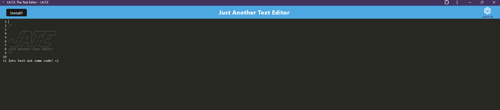

# J.A.T.E. The Text Editor
 

## Description:

 Hello my name is J.A.T.E., your friendly text editor!  Whether you just need a note pad or want to write some code I will be here for you.  Fun Fact!  I am also a PWA.  Hit the install button and take me on the go.  

## Table of Contents
- [Installation](#installation)
- [Usage](#usage)
- [License](#license)
- [Contributing](#contributing)
- [Tests](#tests)
- [Questions](#questions)

## Installation:
Visit from the link listed below!  If you visit by link there shouldn't be any installation procedure however if you visit me from a GitHub repo type in `npm run start:dev`

## Usage:

 My blank canvas is your oyster!  Go crazy and have fun.  The webpage should render as follows: 
 

## License:

 This repo is under no license.

## Contributing:

 Contributors:
 

[Chris Williams](https://github.com/xChrisxWilliamsx)

## Test: 

 Deployed on render. Used in Google Chrome Dev Tools environment during development.  No test files in this repo. 

## Questions:

 Feel free to reach out with any questions using the link below
 

[GitHub](https://github.com/xChrisxWilliamsx)

 Or email at williamsc0325@gmail.com